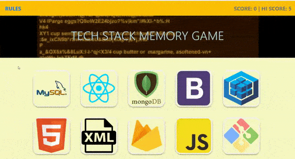

# react-memory-game
Each logo may only be clicked once; clicking the same one twice results in a loss. Special ending for a max score.

# tech
React, Bootstrap, CSS, HTML

# goals
A front-end app built for practice with foundational React concepts: components, props, children, importing/exporting, dynamic component creation with the map method, conditional rendering, and others.

# try it yourself!
https://jwkeena.github.io/react-memory-game/

